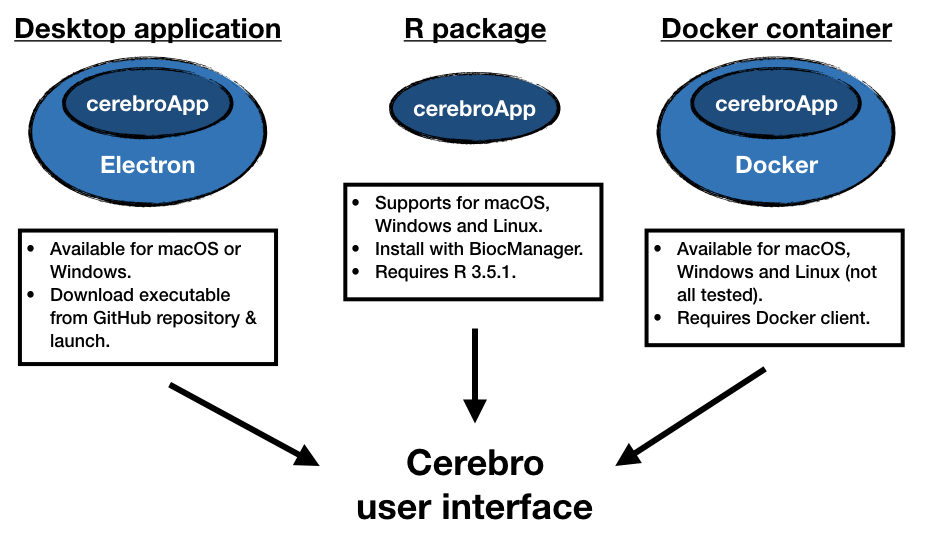
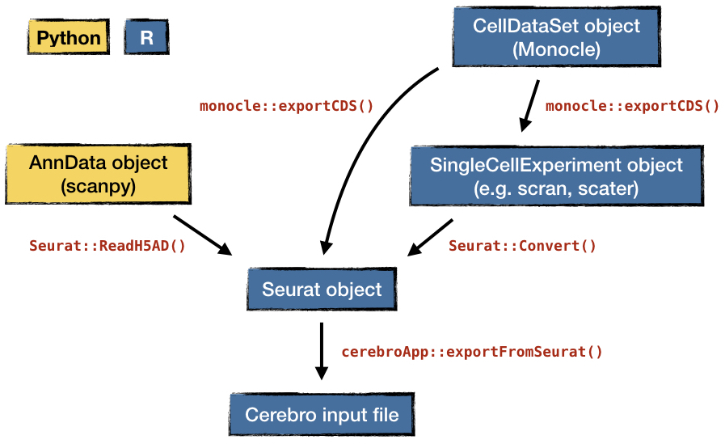

[](https://opensource.org/licenses/MIT)
[](https://twitter.com/fakechek1)

# Cerebro


<!-- START doctoc generated TOC please keep comment here to allow auto update -->
<!-- DON'T EDIT THIS SECTION, INSTEAD RE-RUN doctoc TO UPDATE -->
**Table of Contents**

- [Cerebro](#cerebro)
  - [Introduction to the Cerebro interface](#introduction-to-the-cerebro-interface)
    - [Load data](#load-data)
    - [Overview](#overview)
    - [Samples](#samples)
    - [Clusters](#clusters)
    - [Most expressed genes](#most-expressed-genes)
    - [Marker genes](#marker-genes)
    - [Enriched pathways](#enriched-pathways)
    - [Gene expression](#gene-expression)
    - [Gene set expression](#gene-set-expression)
    - [Trajectory](#trajectory)
    - [Gene ID conversion](#gene-id-conversion)
    - [Analysis info](#analysis-info)
  - [Motivation](#motivation)
  - [Installation](#installation)
    - [Details: `cerebroApp` R package](#details-cerebroapp-r-package)
    - [Details: `romanhaa/cerebro` Docker container](#details-romanhaacerebro-docker-container)
  - [Example data sets](#example-data-sets)
  - [Conversion of other single cell data formats](#conversion-of-other-single-cell-data-formats)
  - [Technical notes](#technical-notes)
  - [Building from source](#building-from-source)
    - [On macOS](#on-macos)
    - [On Windows](#on-windows)
  - [Troubleshooting](#troubleshooting)
  - [Credits](#credits)
  - [Contribute](#contribute)
  - [Citation](#citation)
  - [License](#license)

<!-- END doctoc generated TOC please keep comment here to allow auto update -->


<p align="center"></p>

This is the standalone version of [Cerebro](https://github.com/romanhaa/cerebroApp), **ce**ll **re**port **bro**wser, (currently available for macOS and Windows) which allows users to **interactively** visualize various parts of single cell transcriptomics data without requiring bioinformatic expertise.

The core of Cerebro is the [cerebroApp](https://github.com/romanhaa/cerebroApp) [Shiny](https://shiny.rstudio.com/) application which is bottled into a standalone app using [Electron](https://electronjs.org/).
Therefore, it can also be run on web servers and Linux machines, requiring only R and a set of dependencies.

Input data needs to be prepared using the [cerebroApp](https://github.com/romanhaa/cerebroApp) R package which was built specifically for this purpose.
It offers functionality to export a [Seurat](https://satijalab.org/seurat/) object (both v2 and v3 are supported) to the correct format in a single step.
The file should be saved either with the `.crb` or `.rds` extension, indicating that internally it is an RDS object.
Furthermore, the cerebroApp package also provides functions to perform a set of (optional) analyses, e.g. gene set enrichment analysis, pathway enrichment analysis based on marker gene lists of groups of cells, and more.

The exported `.crb` file is then loaded into Cerebro and shows all available information.

Key features:

* Interactive 2D and 3D dimensional reductions.
* Sample and cluster overview panels.
* Tables of most expressed genes and marker genes for samples and clusters.
* Tables of enriched pathways for samples and clusters.
* Query gene(s) and gene sets from [MSigDB](https://http://software.broadinstitute.org/gsea/msigdb) and show their expression in dimensional reductions.
* **NEW** Visualize trajectories calculated with Monocle v2.
* All plots can be exported to PNG. In addition, 2D dimensional reductions can be exported to PDF.
* Tables can be downloaded in CSV or Excel format.

Basic examples for [Seurat](https://satijalab.org/seurat/) v2 and v3 and [scanpy](https://scanpy.readthedocs.io) workflows and subsequent exporting can be found in the [`examples`](examples) folder.
There you can also find the raw data and the output file that can be loaded into Cerebro.

Further screenshots can be found in the [`screenshots`](screenshots) folder.

## Introduction to the Cerebro interface

Below you find a brief description of what each panel of the Cerebro interface shows.

**For more detailed description, written for biologists without computational expertise, head over [here](README_for_biologists.md).**

### Load data

Select input file (`.rds` or `.crb`).
Shows number of cells, samples, clusters, as well as experiment name and organism.

### Overview

Shows 2D and 3D dimensional reductions.
Cells can be colored by meta data variables, automatically coloring the cells using a categorical or continuous scale.
Cells can be randomly down-sampled to improve performance.

### Samples

Shows sample-centric perspective of data.

* Composition of samples by cluster as table and plot.
* Distribution of number of transcripts and expressed genes by sample.
* Distribution of mitochondrial and ribosomal gene expression by sample (if it was computed with `cerebroApp`).
* Cell cycle by sample, either determined by the Seurat function or using Cyclone (if it was computed and assigned during exporting).

### Clusters

Shows cluster-centric perspective of data.
See info about `Samples` panel above for more details.

### Most expressed genes

If computed in `cerebroApp`, provides tables of most expressed genes by sample and cluster.

### Marker genes

If computed in `cerebroApp`, provides tables of marker genes by sample and cluster.

### Enriched pathways

If computed in `cerebroApp`, provides tables of enriched pathways in marker gene lists of samples and clusters.

### Gene expression

Allows to show the expression of specified genes (showing the average per cell if multiple genes) in the data set.
Calculation is triggered after pressing `SPACE` or `ENTER`.
Multiple genes must be submitted in separate lines or separated by either space, comma, semicolon.
Shows which genes are available or missing (or misspelled) in data set.
Expression levels are shown in dimensional reductions and as violin plots for every sample and cluster.
Average expression across all cells of the 50 most expressed genes (of the ones specified by the user) are shown as well to quickly spot which genes drive the color scale.

### Gene set expression

Basically the same as the gene expression panel except that it allows to select gene sets from [MSigDB](https://http://software.broadinstitute.org/gsea/msigdb) (requires internet connection).
Only available for human and mouse data.

### Trajectory

This tab gives access to trajectory information, if data is available.
Currently, we support trajectories generated by [Monocle](https://cole-trapnell-lab.github.io/monocle-release/) v2 which can extracted through `cerebroApp::extractMonocleTrajectory()`.
Multiple trajectories can be added to a single Seurat object so the user here needs to choose which of those available to visualize.
Several interactive plots will be shown, including dimensional reduction, distribution of categorial variables along pseudotime, composition of transcriptional states by sample, cluster, as well as distribution of transcript counts and number of expressed genes by state.

### Gene ID conversion

Provides table that allows to convert gene IDs and names.
Includes GENCODE identifier, ENSEMBL identifier, HAVANA identifier, gene symbol and gene type.
Only available for mouse and human.
Based on GENCODE annotation version M16 (mouse) and version 27 (human).

### Analysis info

Overview of parameters that were used during the analysis, as long as they were provided.
Also shows list of mitochondrial and ribosomal genes present in the data set if computed with `cerebroApp`.

## Motivation

Single cell RNA-sequencing data is rich and complex.
Allowing experimental biologists to explore the results is beneficial for the iterative scientific process of performing analysis and deriving conclusions.
Cerebro provides an easy way to access the data without any bioinformatic expertise.

## Installation

For people without any experience in using the command line, getting access to Cerebro is probably easiest by downloading Cerebro for your OS from [here](https://github.com/romanhaa/Cerebro/releases), then unpacking and launching it.
Currently, Cerebro is available only for macOS and Windows.

More experienced users of all platforms can alternatively launch the app through the dedicated `cerebroApp` R package - which is the core Cerebro - or the `romanhaa/cerebro` Docker container.

Please check the image and table below for an overview of the supported operating systems and requirements of each way to start Cerebo.

<p align="center"></p>

| | **Standalone desktop application** | **cerebroApp R package** | **Docker container** |
|-:|:-:|:-:|:-:|
| **Link** | [Releases](https://github.com/romanhaa/Cerebro/releases) | [GitHub](https://github.com/romanhaa/cerebroApp) | [Docker Hub](https://cloud.docker.com/u/romanhaa/repository/docker/romanhaa/cerebro) |
| **Supported OS** | macOS, Windows | macOS, Windows, Linux | macOS, Windows, Linux<br>(not all tested) |
| **Requirements** | - | R (3.5.1 or higher) | Docker client |
| **Installation** | Download current release from GitHub repository | Through BiocManager::install() | Pull container from Docker Hub |
| **Launch Cerebro** | Double-click executable | Inside R | Start container |

### Details: `cerebroApp` R package

Requirements: R (version 3.5.1 or higher)

A convenient IDE would be RStudio but it can be done from any R session.
Make sure to install `cerebroApp` using `BiocManager::install()` to get the most recent version of dependencies on Bioconductor.

```r
BiocManager::install("romanhaa/cerebroApp")
cerebroApp::launchCerebro()
```

### Details: `romanhaa/cerebro` Docker container

Requirements: Docker client

```bash
docker pull romanhaa/cerebro:latest
docker run -p 8080:8080 -v <export_folder>:/plots romanhaa/cerebro
# for example
docker run -p 8080:8080 -v ~/Desktop:/plots romanhaa/cerebro
```

Then, in your browser you navigate to the address printed in the terminal, e.g. `127.0.0.1:8080`.

**Note 1**: Binding a local directory with `-v <export_folder>:/plots` is only necessary if you want to export dimensional reductions from Cerebro.

**Note 2**: If you need to change the port, you can do that like this:

```bash
docker run -p <port_of_choice>:8080 -v <export_folder>:/plots romanhaa/cerebro
# OR
docker run -p <port_of_choice>:<port_of_choice> -v <export_folder>:/plots romanhaa/cerebro Rscript -e 'shiny::runApp(cerebroApp::launchCerebro(), port=<port_of_choice>, host="0.0.0.0", launch.browser=FALSE)'
```

## Example data sets

We provide documentation and commands for the following example data sets:

* [`pbmc_10k_v3`](examples/pbmc_10k_v3): single sample of human peripheral blood mononuclear cells
* [`GSE108041`](examples/GSE108041): 4 samples of A549 cells before and after infection with influenza virus
* [`GSE129845`](examples/GSE129845): 3 samples of human bladder cells from (3 patients)

## Conversion of other single cell data formats

Currently, the `cerebroApp` R package only provides a functions to export a `Seurat` (v2 or v3) object to the Cerebro input file.
However, there are a few other important single cell data storage formats, e.g. `AnnData` (used by [scanpy](https://scanpy.readthedocs.io/en/stable/), `SingleCellExperiment` (used by [scran](https://bioconductor.org/packages/release/bioc/html/scran.html) and [scater](https://bioconductor.org/packages/release/bioc/html/scater.html)), and `CellDataSet` (used by [Monocle](https://cole-trapnell-lab.github.io/monocle-release/)).

We believe using the existing network of conversion/exporting functions is more efficient than creating a dedicated export function for scanpy data.
To highlight how data processed with scanpy (stored in `AnnData` format) can be prepared for loading into Cerebro, we have prepared a [scanpy-based workflow](examples/pbmc_10k_v3/scanpy) for the `pbmc_10k_v3` example data set.

In the figure below, we highlight how you can generate the Cerebro input file from any of the four major formats.

<p align="center"></p>

## Technical notes

* Cerebro is a [Shiny](https://shiny.rstudio.com/) app that is bottled into a standalone application using [Electron](https://electronjs.org/).
* Plotting relies heavily on [`ggplot2`](https://ggplot2.tidyverse.org/) and [`plotly`](https://plot.ly/r/).
* Tables are built with [`formattable`](https://renkun-ken.github.io/formattable/).
* Access to MSigDB through [`msigdbr`](https://cran.r-project.org/web/packages/msigdbr/vignettes/msigdbr-intro.html).

## Building from source

### On macOS

To package Cerebro you need [Git](https://git-scm.com) and [Node.js](https://nodejs.org/en/download/) (which comes with [npm](http://npmjs.com)) installed on your computer.
Then, from the command line, run:

```bash
# clone this repository
git clone https://gitlab.com/romanhaa/Cerebro.git
# install Electron packager
npm install electron-packager --global
# go into the repository
cd Cerebro
# install dependencies
npm install
# run the app
npm start
# build the app
npm run package-mac
```

To build the Windows version under macOS it is necessary to install Wine.
I experienced problems with missing libraries of the stable version (4.0) so I recommend to use the developers version (4.4) using Homebrew:

```bash
brew tap caskroom/versions
brew update
brew install caskroom/versions/wine-devel
npm run package-win
```

### On Windows

If you're using Linux Bash for Windows, [see this guide](https://www.howtogeek.com/261575/how-to-run-graphical-linux-desktop-applications-from-windows-10s-bash-shell/) or use `node` from the command prompt.

## Troubleshooting

* If the app shows a blank/white window, press CMR+R (macOS) or CTRL+R (Windows) to refresh the page. Especially on slower machines it can happen that the interface loads before the Shiny application is launched.

## Credits

* Columbus Collaboratory laid out the basics of using Electron to create a standalone Shiny application: <https://github.com/ColumbusCollaboratory/electron-quick-start>
* Color palettes were put together with colored from: https://flatuicolors.com/
* The initial app icon (until v1.2) was made by [Kiranshastry](https://www.flaticon.com/authors/kiranshastry) from [https://www.flaticon.com](https://www.flaticon.com/) and is licensed by [CC 3.0 BY](http://creativecommons.org/licenses/by/3.0/)

## Contribute

To report any bugs, submit patches, or request new features, please log an issue [through the issue tracker](https://github.com/romanhaa/Cerebro/issues/new). For direct inquiries, please send an email to <a href = "mailto: roman.hillje@ieo.it">roman.hillje@ieo.it</a>.

## Citation

If you used Cerebro for your research, please cite the following publication:

Roman Hillje, Pier Giuseppe Pelicci, Lucilla Luzi, Cerebro: interactive visualization of scRNA-seq data, Bioinformatics, btz877, [https://doi.org/10.1093/bioinformatics/btz877](https://doi.org/10.1093/bioinformatics/btz877)

## License

Copyright (c) 2019 Roman Hillje

[The MIT License (MIT)](LICENSE.md)
